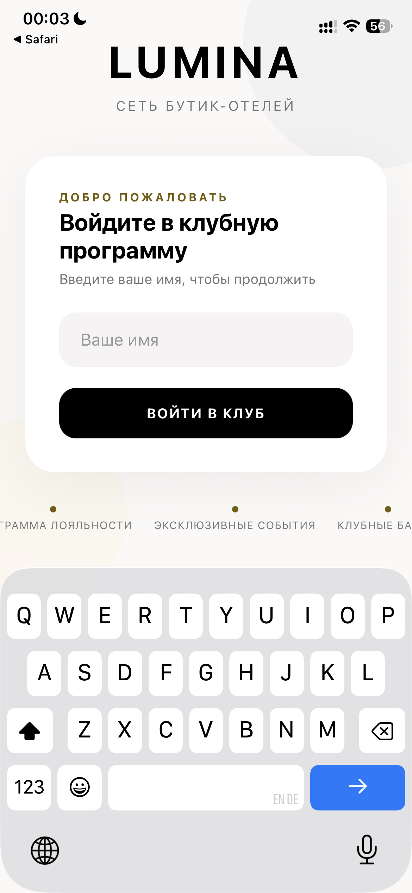
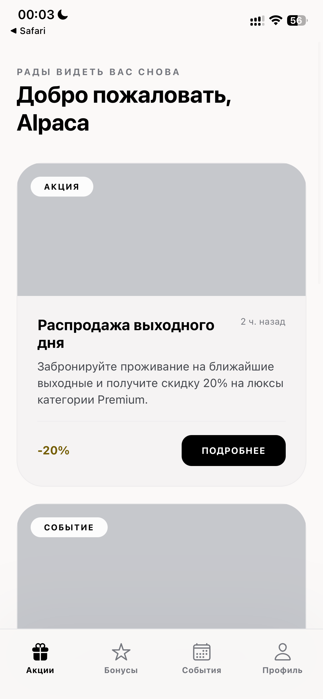
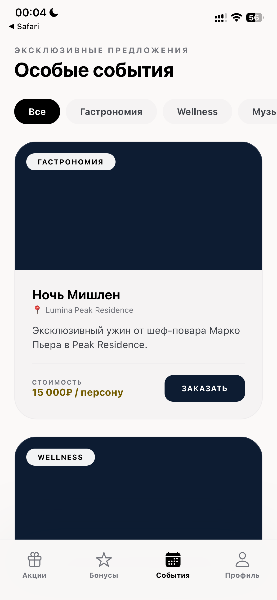
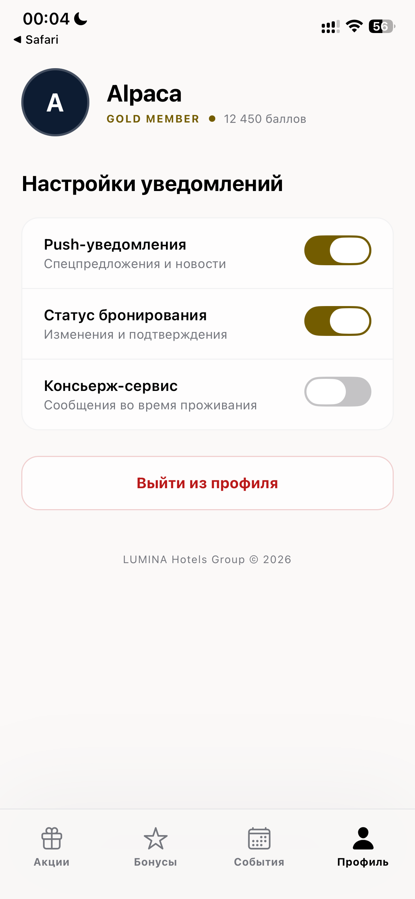

# Attention

this is only a design demo created by me, not full-production app template.
DESIGNREFERENCE - Generated by using Stitch

# HotelMate

Hotel loyalty mobile application.

<h2>Screenshots</h2>

  
  
  

  
  

## Screenshots

| Login | Home |
|-------|------|
|  |  |

| Bonuses | Events |
|---------|--------|
|  |  |

| Profile |
|---------|
|  |

## Features

- Loyalty program
- Promotions
- Events
- Guest profile

## Stack

- Expo SDK 54
- React Native
- TypeScript
- Expo Router
- NativeWind (deprecated)

...

Just tryin to build simple ios applicaton
